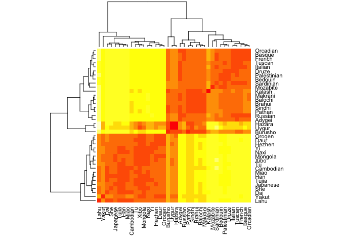
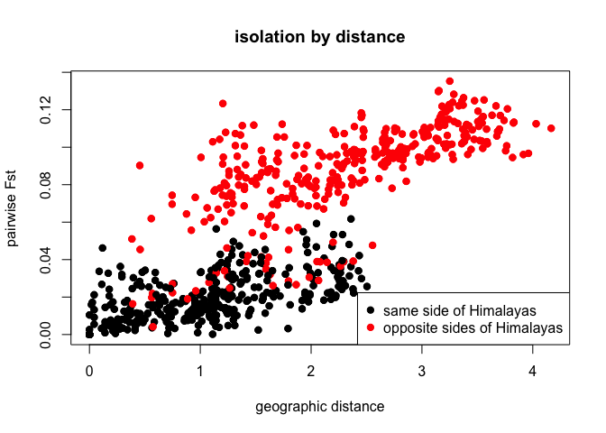

F-statistics from genotypic data:
---------------------------------

In this exercise we will estimate the **Fst**, which is the expected level of heterozygosity in a population. The expected heterozygosity frequencies are drawn under the conditions of **Hardy-Weiberg Theorem**. It can be used to measure also the genetic variation across populations, by looking at the deviations of genetic diversity withing subpopulations (*H*<sub>*S*</sub>) to the genetic diversity of the total population (*H*<sub>*T*</sub>):

$F\_{ST} = \\frac{H\_T - H\_S}{H\_T}$

9 equations will be used in this exercise:

1 Calculation of allele frequencies:

$p = \\frac{(2AA + Aa)}{2N}$

2 Calculation of the expected genotypic counts under HWE:

-   Expected AA = *p*<sup>2</sup> \* *N*
-   Expected Aa = 2*p* \* *q* \* *N*
-   Expected aa = *q*<sup>2</sup> \* *N*

3 Calculate the local observed heterozygosity

$H\_{obs} = \\frac{Aa}{N}$

4 Calculate the local expected heterozygosity

*H*<sub>*e**x**p*</sub> = 2*p**q*

1.  Calculate the local inbreeding coefficient of each subpopulation

$F\_S = \\frac{H\_{exp} -H\_{obs}}{H\_{exp}}$

1.  Calculate $\\bar{p}$ (the frequency pf allele **A** over the total population)

$\\bar{p} = \\frac{2\*AA\_{pop1} + Aa\_{pop1} + 2\*AA\_{pop2} + Aa\_{pop2} + 2\*AA\_{pop3} + Aa\_{pop3}}{2\*N\_{pop1} 2\*N\_{pop2} + 2\*N\_{pop3}}$

1.  Calculate $\\bar{q}$ (the frequency pf allele **a** over the total population)

$\\bar{q} = \\frac{2\*aa\_{pop1} + Aa\_{pop1} + 2\*aa\_{pop2} + Aa\_{pop2} + 2\*aa\_{pop3} + Aa\_{pop3}}{2\*N\_{pop1} 2\*N\_{pop2} + 2\*N\_{pop3}}$

1.  Calculate the global heterozygosity indices ( over **I**ndividuals, **S**ubpopulations and **T**otal population)

2.  *H*<sub>*I*</sub> based on observed heterozygosties in individuals in subpopulations:

$H\_I =\\frac{H\_{obs1}\*N\_1 + H\_{obs2}\*N\_2 + H\_{obs3}\*N\_{3}}{N{total}}$

1.  *H*<sub>*S*</sub> based on **expected** heterozygosities in **subpopulations**:

$H\_S =\\frac{H\_{exp1}\*N\_1 + H\_{exp2}\*N\_2 + H\_{exp3}\*N\_3}{N\_{total}}$

1.  *H*<sub>*T*</sub> based o expected heterozygosities for overall total population: $H\_T = 2\\bar{p}\\bar{q}$

2.  Calculate the Fst:

$F\_{ST} = \\frac{H\_T - H\_S}{H\_T}$

``` r
## Let's imagine that we have the following genotypes and genotype frequencies in each population:
M <- as.matrix(rbind(c(125, 250, 125), c(50, 30, 20), c(100, 500, 400)))
dimnames(M) <- list(c("Pop1", "Pop2", "Pop3"), c("AA","Aa", "aa"))

print(M)
```

    ##       AA  Aa  aa
    ## Pop1 125 250 125
    ## Pop2  50  30  20
    ## Pop3 100 500 400

``` r
# What is the number of individuals genotyped in each population?
N = rowSums(M)

# Now let's calculate the allele frequencies in each population. Remember that the number of alleles is twice the number of genotypes.

# Allele A: 
pop1_p = (2*M[1,1] + M[1,2])/(2*N[[1]])

# Allele a:
pop1_q = (2*M[1,3] + M[1,2])/(2*N[[1]])

# Calculate the observed frequency of allele A for the other 2 populations


# Now calculate the local observed heterozygosity:

H_obs_pop1 = 250/500
H_obs_pop2 = 30/100
H_obs_pop3 = 500/1000

# What would be the expected heterozygosity? Remember about the concepts of Hardy Weinberg equilibrium:
H_exp_pop1 = 2*pop1_p*pop1_q

# What is the local inbreeding coefficient of each population?
#F_s = (H_exp - H_obs )/ (H_exp)

F_s_pop1 = (H_exp_pop1 - H_obs_pop1) / H_exp_pop1

# Now calculate the frequency of allele A over the total population (remember to mutiple the N frequencies):
A_s = (2*colSums(M)[[1]] + colSums(M)[[2]])/(2*sum(rowSums(M)))
a_s = (2*colSums(M)[[3]] + colSums(M)[[2]])/(2*sum(rowSums(M)))

# Check if the calculations make sense. p + q must be equal to 1
A_s + a_s
```

    ## [1] 1

``` r
# Now calculate the expected heterozygosity in subpopulations: 
```

Applying Fst in a real dataset:
===============================

HGDP-CEPH Human Genome Diversity Cell Line Panel
------------------------------------------------

In the next exercise we will be using the data from HGDP Panel, a consortium created to allow further research in human population genetics.
A resource of 1063 lymphoblastoid cell lines (LCLs) from 1050 individuals in 52 world populations and corresponding milligram quantities of DNA is banked at the Foundation Jean Dausset-CEPH in Paris. These LCLs were collected from various laboratories by the Human Genome Diversity Project (HGDP) and CEPH in order to provide unlimited supplies of DNA and RNA for studies of sequence diversity and history of modern human populations. Information for each LCL is limited to sex of the individual, population and geographic origin.


``` r
#With the HGDP dataset

#install.packages('BEDASSLE')
library(BEDASSLE)

data(HGDP.bedassle.data)

# Have a loog at what variables the data contain:
?HGDP.bedassle.data()

# How many populations does the data include?
HGDP.bedassle.data$hgdp.metadata$Population
```

    ##  [1] "Adygei"      "Basque"      "Italian"     "French"      "Orcadian"   
    ##  [6] "Russian"     "Sardinian"   "Tuscan"      "Bedouin"     "Druze"      
    ## [11] "Mozabite"    "Palestinian" "Balochi"     "Brahui"      "Burusho"    
    ## [16] "Hazara"      "Kalash"      "Makrani"     "Pathan"      "Sindhi"     
    ## [21] "Cambodian"   "Dai"         "Daur"        "Han"         "Hezhen"     
    ## [26] "Japanese"    "Lahu"        "Miao"        "Mongola"     "Naxi"       
    ## [31] "Oroqen"      "She"         "Tu"          "Tujia"       "Uygur"      
    ## [36] "Xibo"        "Yakut"       "Yi"

``` r
#Draw 2 populations at random from the Eurasian HGDP dataset
    pop1 <- sample(nrow(HGDP.bedassle.data$allele.counts),1)
    pop2 <- sample(nrow(HGDP.bedassle.data$allele.counts),1)

#Calculate unbiased Fst between them
    pairwise.Fst <- calculate.pairwise.Fst(
        HGDP.bedassle.data$allele.counts[c(pop1,pop2),],
        HGDP.bedassle.data$sample.sizes[c(pop1,pop2),]  
    )

#Print that Fst to the console
    print(sprintf("Fst between the %s population and the %s population is %s",
        HGDP.bedassle.data$hgdp.metadata[pop1,1],
        HGDP.bedassle.data$hgdp.metadata[pop2,1],
        round(pairwise.Fst,3))
     )
```

    ## [1] "Fst between the Mongola population and the Kalash population is 0.098"

``` r
# Now Calculate the Fst between populations from "French" and "Hezhen"
    (pairwise.Fst <- calculate.pairwise.Fst(
        HGDP.bedassle.data$allele.counts[c("French","Hezhen"),],
        HGDP.bedassle.data$sample.sizes[c("French","Hezhen"),]  
    ))
```

    ## [1] 0.09608346

``` r
#Calculate pairwise Fst between all population pairs
    hgdp.pairwise.Fst <- calculate.all.pairwise.Fst(
        HGDP.bedassle.data$allele.counts,
        HGDP.bedassle.data$sample.sizes
    )   

colnames(hgdp.pairwise.Fst) = HGDP.bedassle.data$hgdp.metadata$Population
rownames(hgdp.pairwise.Fst) = HGDP.bedassle.data$hgdp.metadata$Population
heatmap(hgdp.pairwise.Fst, names = HGDP.bedassle.data$hgdp.metadata$Population)
```

    ## Warning in plot.window(...): "names" is not a graphical parameter

    ## Warning in plot.xy(xy, type, ...): "names" is not a graphical parameter

    ## Warning in title(...): "names" is not a graphical parameter



``` r
    #Plot pairwise Fst against geographic distance
    plot(HGDP.bedassle.data$GeoDistance,
        hgdp.pairwise.Fst,
        pch=19,
        col=HGDP.bedassle.data$EcoDistance+1,
        ylab="pairwise Fst",
        xlab="geographic distance",
        main="isolation by distance")
            legend(x="bottomright",pch=19,col=c(1,2),
                legend=c("same side of Himalayas",
                        "opposite sides of Himalayas"))
```


